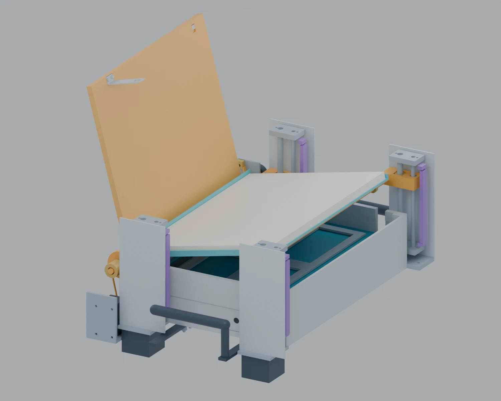

# 스마트 잠금 상자 설계

## R4 — 뚜껑 자동 개폐·종이 받침 상승/경사 추가

[R4 설계와 모델 열기](smart_lock_box_r4/README.md)

뚜껑 모터 1개와 받침 모터 2개를 추가한 별도 수정안입니다. 왼쪽 뚜껑을 105° 열고, 받침을 올린 뒤 오른쪽을 더 높여 12° 기울입니다. 닫을 때는 받침을 먼저 복귀시키고 뚜껑을 닫아 잠급니다. 기존 수동 격납 방식은 고정 힌지로 바뀌며 앞뒤에 구동 모듈이 추가됩니다. 실제 하드웨어 구동과 테미 장착은 검증 전입니다.

- [R4 Blender 모델](smart_lock_box_r4/smart_lock_box_r4.blend) · [GLB 애니메이션](smart_lock_box_r4/smart_lock_box_r4.glb)
- [모터·기구 계산](smart_lock_box_r4/MOTORS_AND_MECHANISM.md) · [제어·배선 설계](smart_lock_box_r4/CONTROL_AND_WIRING.md)

## R3 — 기존 단일 적재판 설계

이번 수정본은 **R3-A4**입니다. 상부 칸막이를 없애고, 단일 적재판 아래에 전원·회로·로드셀·잠금장치를 둔 이중 바닥으로 변경했습니다.

- [R3 편집 모델 및 개폐 애니메이션](smart_lock_box_r3/smart_lock_box_r3.blend)
- [R3 배치·회로 설명서 PDF](smart_lock_box_r3/assembly_and_circuit_r3.pdf)
- [R3 전체 패키지 ZIP](smart_lock_box_r3_package.zip)
- [설계 변경·사용법·검증 한계](smart_lock_box_r3/README.md)
- [실행한 검증 결과](smart_lock_box_r3/validation/summary.json)

CAD 이동 632자세·애니메이션 144프레임, C++ 검사 235개, 통신 테스트 10개 및 Nano 컴파일을 통과했습니다. **A4 한 장의 실제 검출, 강도, 발열, 테미 장착은 아직 실물 검증 전입니다.**

외형은 A4 폭을 확보하기 위해 255×324×78 mm로 변경했습니다. 전원은 안정화 12 V 입력 기준이며 내부 배터리는 미선정입니다. 기존 `smart_lock_box.blend`, `assembly_and_circuit.pdf`, 두 원본 ZIP은 보존했습니다.
