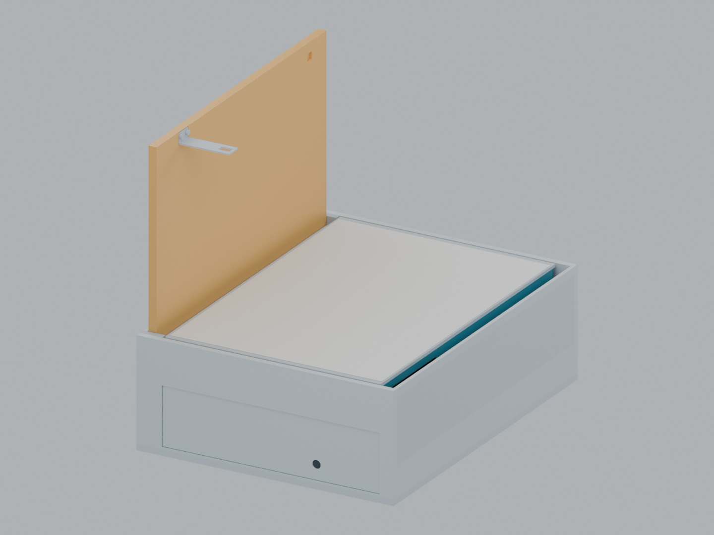

# 스마트 잠금 상자 — R3-LIFT

**R4를 폐기하고 R3를 기준으로 다시 설계했습니다.** 모터는 하부 회로 공간 안에 완전히 들어가며, 종이를 담는 중간 바닥이27mm 올라옵니다. 사용자가 허용한 외형은255×324×108mm입니다.

- **[새 설계 설명](smart_lock_box_r3_lift/README.md)**
- **[주문 부품리스트·구매 링크](smart_lock_box_r3_lift/PURCHASE_LIST.md)** · [BOM CSV](smart_lock_box_r3_lift/BOM.csv)
- [Blender 편집 모델](smart_lock_box_r3_lift/smart_lock_box_r3_lift.blend) · [GLB 및 애니메이션](smart_lock_box_r3_lift/smart_lock_box_r3_lift.glb)
- [전체 패키지 ZIP](smart_lock_box_r3_lift_package.zip)
- [내부 구동부](smart_lock_box_r3_lift/drawings/03_internal_drive.png) · [가공·조립](smart_lock_box_r3_lift/FABRICATION.md)
- [실행한 검증](smart_lock_box_r3_lift/validation/geometry.json) · [실물 확인표](smart_lock_box_r3_lift/HARDWARE_ACCEPTANCE.md)

모터는 실제 판매 중인 Actuonix PQ12-100-12-S, 기구는 MGN7C·LM6UU·623ZZ 규격을 기준으로 모델링했습니다. R3의 A4적재판·로드셀·잠금·수동 격납 도어를 유지합니다. 자동 승강은 적재 바닥에 적용했습니다.

CAD와 구매·가공 설계 단계이며, 새 승강 제어 펌웨어의 보드 통합·실물 구동·A4 한 장 감지·강도·테미 장착은 미검증입니다. 상세 구매 옵션과 미확인 항목은 부품리스트를 확인하세요.

[기준 R3 원본](smart_lock_box_r3/README.md)은 보존했습니다. R4의 마지막 상태는 Git 커밋 `fa6051f`에 남고 현재 basket에서는 제거했습니다.
