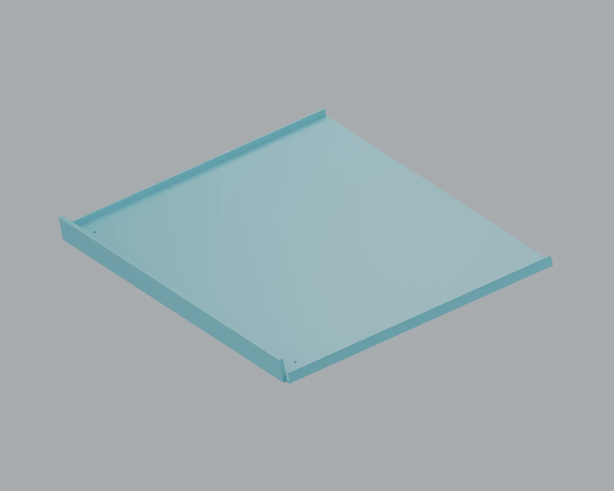

# R4 — 경사 상승 + 종이 이탈 방지 받침

R4가 삭제되기 전 마지막 커밋 `fa6051f`의 모델과 앞뒤 손잡이를 복원해 수정했다. 현재 저장소의 R3-LIFT는 별도로 유지한다.

- **[수정된 Blender 모델](smart_lock_box_r4.blend)** · [GLB 애니메이션](smart_lock_box_r4.glb)
- **[3D 프린터 출력 준비본](print_ready/README.md)** · [출력용 Blender](print_ready/smart_lock_box_r4_print.blend) · [출력 패키지 ZIP](r4_print_ready.zip)
- [회로 없는 조립 상태 Blender](print_ready/r4_mechanical_no_circuits.blend)
- [부품별 STL / 220 mm 베드](print_ready/STL_print/) · [출력 목록](print_ready/PRINT_LIST.csv)


## 변경한 동작과 받침

뚜껑 쪽인 왼쪽이 낮고 오른쪽이 높다. 뚜껑이 105°까지 열린 뒤, **받침이 올라가는 동안 0°에서 12°까지 함께 기울어진다.** 내려갈 때는 반대 궤적으로 경사를 풀면서 내려간다. 높은 쪽의 최종 위치와 기존 12° 경사는 그대로다.

| 항목 | 수정 결과 |
|---|---|
| 높은 쪽 종이 받침 상면 | 최종 Z **127.933854 mm**, 기존 R4와 동일 |
| 기존 낮은 가장자리 기준점 | 최종 Z **83.544708 mm**, 기존 R4와 동일 |
| 승강·경사 | 기준 축 35 mm 상승과 12° 경사를 19초 동안 동시 진행 |
| 낮은 쪽 받침 | 바닥에 일체로 붙은 **ㄴ자 이탈 방지턱**; 밑으로 빠지는 틈 없음 |
| 턱 치수 | 두께 **3.2 mm**, 종이 접촉면 위 **15 mm**, 길이 **299 mm** |
| 종이 공간 | 210 × 297 mm A4, 높이 10 mm의 기존 종이 묶음 기준 |
| 받침판 바닥 | 3 mm; 높은 쪽에 추가 벽을 만들지 않음 |
| 간섭 해소 | 낮은 축 통과구와 앞뒤 상단 턱의 안쪽을 경사 상승 경로에 맞게 확대 |

이탈 방지턱은 받침판과 실제 Boolean union으로 연결된 하나의 닫힌 메시다. 프린터 준비본에서는 앞뒤의 작은 종이 턱도 받침판에 합쳐 출력한다.



| Blender 프레임 | 상태 |
|---|---|
| 1 | 닫힘, 받침 안착 |
| 265 | 뚜껑 열림 |
| 289 | 두 승강축이 받침을 받친 상태 |
| 517 | 상승 중간, 6° 경사 |
| 745 | 완전 상승, 12° 경사; 파일의 기본 표시 상태 |
| 865–1321 | 경사를 풀면서 하강 |
| 1644 | 닫힘·잠금 복귀 |

## 출력과 기구 부품

`print_ready/STL_print/`만 출력용이다. 모두 mm 좌표이며, 개별 파일을 100% 크기로 슬라이서에 넣는다. 큰 부품은 220 × 220 mm 베드를 기준으로 나누고 8 mm 겹침 이음을 넣었다. 회로보드·배선·모터·나사·축·베어링 형상은 출력용 STL에 포함하지 않는다.

`parts/`는 조립 위치의 원래 가공 형상으로, 금속 부품도 포함한다. 운반 손잡이·긴 금속축·계량 프레임·잠금 부품·힌지 허브 등은 금속으로 유지하며 [출력하지 않는 부품 목록](print_ready/NON_PRINTED_PARTS.csv)에 표시한다. 출력 준비본의 PETG 몸체·판·브래킷은 시제품용이며, 기존 금속의 강도나 손잡이 하중 정격을 인증한 것이 아니다. 출력·접합·하중·실제 구동 시험은 아직 하지 않았다.

기존 R4의 순차 승강 제어 코드는 새 궤적과 일치하지 않아 이번 복원본에 포함하지 않았다. Blender와 GLB의 동작은 기구 검토용 애니메이션이며, 실제 모터 제어 펌웨어 통합은 별도다.

## 재생성 및 검사

Python 3.11에 `bpy==4.5.3`, `trimesh==5.1.0`, `manifold3d==3.5.3`, `Pillow`, `numpy<2`를 설치한 환경에서 저장소 루트 기준:

```bash
python basket/smart_lock_box_r4/build_r4.py
python basket/smart_lock_box_r4/validate_r4.py
python basket/smart_lock_box_r4/prepare_print.py
python basket/smart_lock_box_r4/render_r4.py
python basket/smart_lock_box_r4/render_print.py
python basket/smart_lock_box_r4/package_review.py
```

Blender 4.5.3의 `blender -b --python ...`으로도 실행할 수 있다. 출력 준비 스크립트의 Python 패키지가 Blender Python에도 설치되어 있어야 한다. R3 기준 원본 파일을 사용하므로 저장소 폴더 구조를 유지한다.

- [기구 검사](validation/geometry.json): 동작 중 메시 간섭, 두 축 위치·속도, 높은 쪽 기준점, 롤러 접촉식, 닫힘 순서, 메시의 열린 모서리.
- [출력 검사](print_ready/print_manifest.json): STL 재읽기, 닫힌 메시·양의 부피·출력 범위·바닥 배치, 분할 전후 부피 및 원래 조립 위치 변환.
- [실제 출력 배치 미리보기](drawings/06_print_plates.webp): 67개 개별 베드.
- 검사 제외: 실제 휨·마찰·접착 강도·벨트 치형·배선 굴곡·실물 공차·테미 장착. 힌지/롤러/축의 의도된 조인트 접촉은 간섭 검사에서 구분한다.
